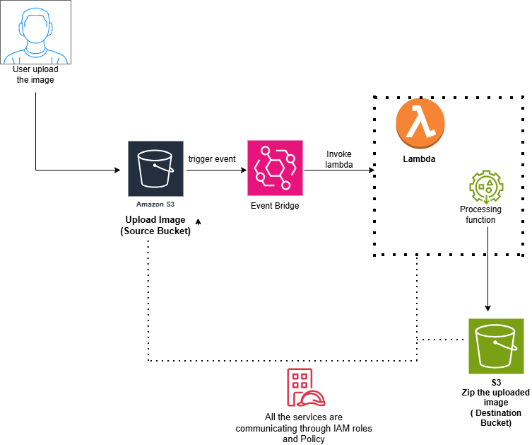
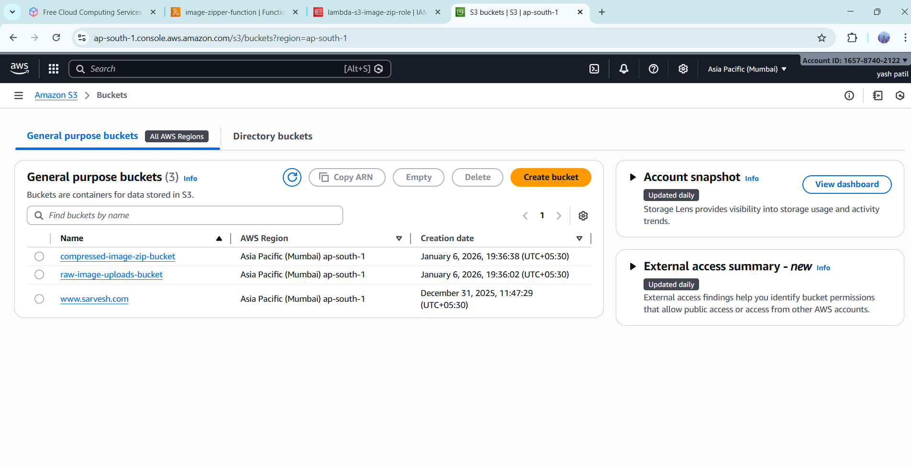
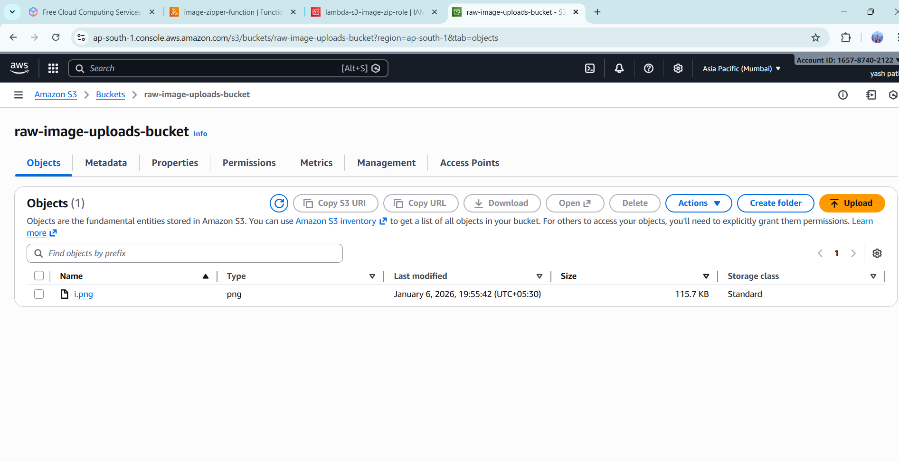
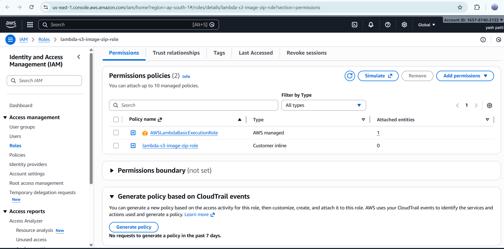
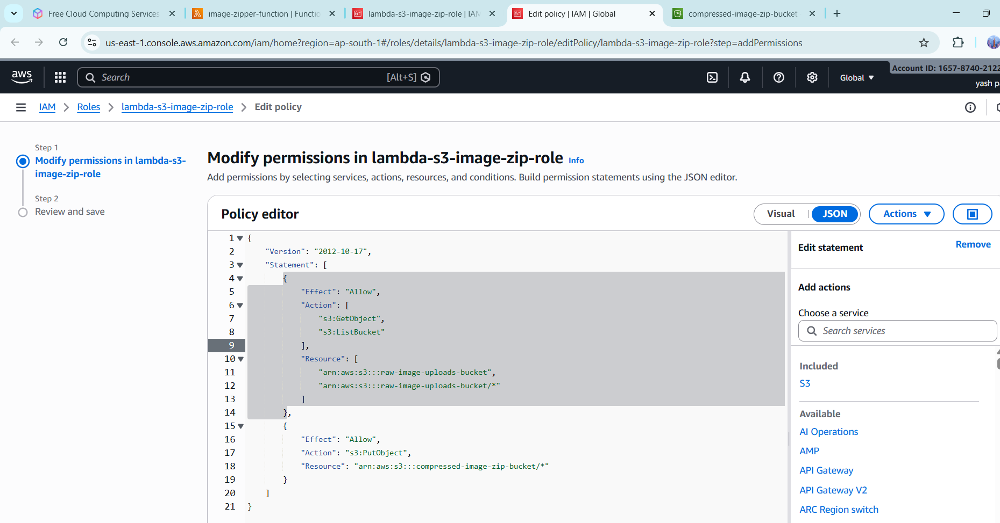
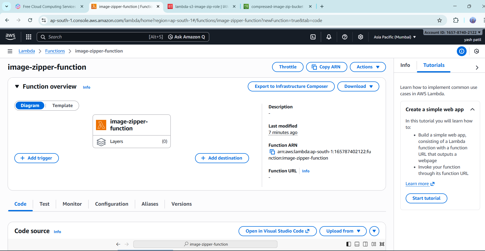
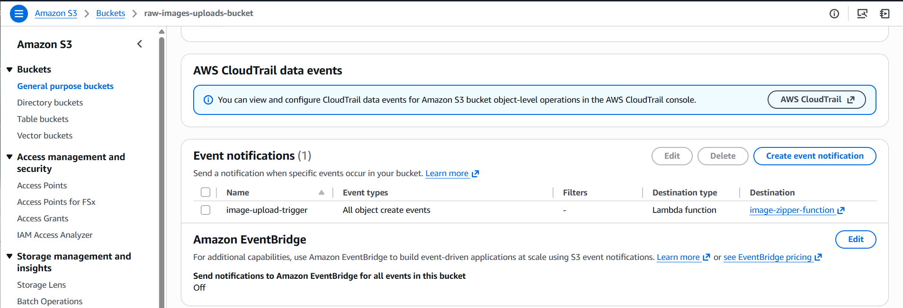
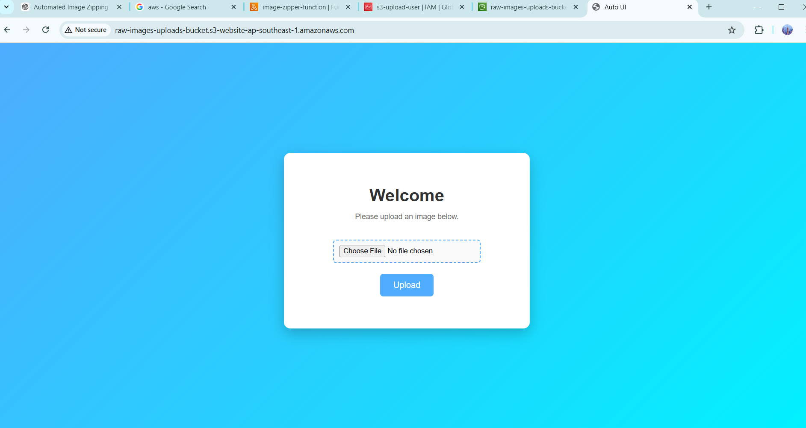
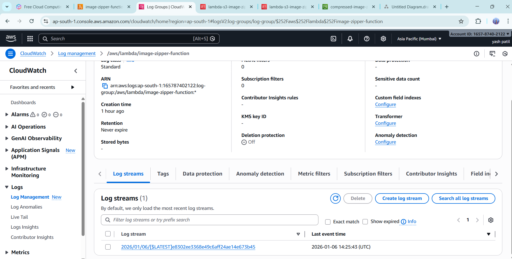

# Automated Image Zipping Pipeline using AWS Serverless Services

##  Overview

This project demonstrates a serverless image processing pipeline using AWS.
When a user uploads an image through a simple HTML UI, the image is stored in an Amazon S3 bucket. An AWS Lambda function is automatically triggered, compresses the image into a ZIP file, and stores the compressed file in another S3 bucket.

This architecture is fully automated, scalable, and serverless.

##  AWS Services Used

- Amazon S3 – Object storage for raw and compressed images

- AWS Lambda – Serverless compute for image compression

- AWS IAM – Role and permission management

- Amazon S3 Event Notifications – Automatically trigger Lambda when an image is uploaded

##  Architecture



---

##  Step-by-Step Configuration

## Step 1: Create S3 Buckets

- Create a source S3 bucket to store raw uploaded images.<br>
  Example: raw-image-uploads-bucket

- Create a destination S3 bucket to store compressed ZIP files.<br>
  Example: compressed-image-zip-bucket




## Step 2: Create IAM Role for Lambda

- Create an IAM role with AWS Lambda as the trusted service.

- Attach the following permissions:

- s3:GetObject and s3:ListBucket for the source bucket

- s3:PutObject for the destination bucket

- Attach AWSLambdaBasicExecutionRole for CloudWatch logging.
- create inline policy and role

```

{
 "Version": "2012-10-17",
 "Statement": [
  {
   "Effect": "Allow",
   "Action": ["s3:GetObject"],
   "Resource": "arn:aws:s3:::raw-images-uploads-bucket/*"
  },
  {
   "Effect": "Allow",
   "Action": ["s3:PutObject"],
   "Resource": "arn:aws:s3:::compressed-images-zip-bucket/*"
  }
 ]
}


```



## Step 3: Create AWS Lambda Function

- Create a Lambda function using Python 3.10 runtime.

- Assign the previously created IAM role.

```
import boto3
import zipfile
import os

s3 = boto3.client('s3')

def lambda_handler(event, context):

    # Get bucket name and file key from event
    bucket = event['Records'][0]['s3']['bucket']['name']
    key = event['Records'][0]['s3']['object']['key']

    # Define temporary file paths
    download_path = '/tmp/' + key
    zip_path = '/tmp/' + key + '.zip'

    # Download image from S3
    s3.download_file(bucket, key, download_path)

    # Create ZIP file
    with zipfile.ZipFile(zip_path, 'w') as zipf:
        zipf.write(download_path, os.path.basename(download_path))

    # Upload ZIP file to compressed bucket
    s3.upload_file(zip_path, 'compressed-images-zip-bucket', key + '.zip')

    return {
        'statusCode': 200,
        'body': 'File compressed successfully'
    }

```

- test and deploy



## Step 4: Configure S3 Event Trigger

- Configure an ObjectCreated event notification on the source S3 bucket.

- Set AWS Lambda as the destination.

- Optionally restrict triggers using file suffixes (e.g., .jpg, .png).



## Step 5: Create Upload UI
- upload index.html, style.css, app.js file to raw bucket 
- make the raw upload bucket public access 
- enable static host 
```
<!DOCTYPE html>
<html lang="en">
<head>
    <meta charset="UTF-8">
    <meta name="viewport" content="width=device-width, initial-scale=1.0">
    <title>Auto UI</title>
    <link rel="stylesheet" href="style.css">
    <script src="https://sdk.amazonaws.com/js/aws-sdk-2.283.1.min.js"></script>
    <script src="app.js"></script>
</head>
<body>
    <div class="container">
        <h1>Welcome</h1>
        <p>Please upload an image below.</p>
        <input type="file" id="imageInput" accept="image/*">
        <button onclick="uploadImage()">Upload</button>
        <div id="status"></div>
    </div>
</body>
</html>
body{

font-family:Arial, sans-serif;

background:linear-gradient(135deg,#4facfe,#00f2fe);

height:100vh;

display:flex;

justify-content:center;

align-items:center;

margin:0;

}

.container{

background:white;

padding:40px;

border-radius:12px;

text-align:center;

box-shadow:0 10px 25px rgba(0,0,0,0.2);

width:380px;

}

h1{

color:#333;

margin-bottom:10px;

}

p{

color:#777;

font-size:14px;

}

input{

margin-top:20px;

}

input[type="file"]{

border: 2px dashed #4facfe;

padding: 10px;

border-radius: 6px;

background: #f9f9f9;

cursor: pointer;

}

input[type="file"]:hover{

border-color: #0077ff;

}

button{

margin-top:20px;

padding:12px 25px;

background:#4facfe;

color:white;

border:none;

border-radius:6px;

cursor:pointer;

font-size:16px;

transition:0.3s;

}

button:hover{

background:#0077ff;

}

#status{

margin-top:20px;

font-weight:bold;

}


```

## Step 6: create a uploaded image script 

```
AWS.config.update({
accessKeyId:"your_access_key",
secretAccessKey:"your_secret_key",
region:"ap-southeast-1"
});


function uploadImage() {

const fileInput = document.getElementById('imageInput');
const status = document.getElementById('status');
const file = fileInput.files[0];

if (!file) {
status.textContent = 'Please select an image.';
return;
}

const s3 = new AWS.S3();

const params = {
Bucket: "raw-images-uploads-bucket",
Key: file.name,
Body: file,
ContentType: file.type
};

s3.putObject(params, function(err, data){

if(err){
console.error(err);
status.textContent = 'Upload failed';
}else{
status.textContent = 'Upload successful';
}

});

}

```


---


## Step 7: Configure CORS for S3
- Go to:

S3 → raw-images-uploads-bucket → Permissions → CORS

- Add 
```
[
    {
        "AllowedHeaders": [
            "*"
        ],
        "AllowedMethods": [
            "GET",
            "PUT",
            "POST",
            "DELETE",
            "HEAD"
        ],
        "AllowedOrigins": [
            "*"
        ],
        "ExposeHeaders": []
    }
]


```

## 6 cloudwatch log of lambda


--

## Benefits of This Project

- Fully serverless architecture

- Event-driven automation

- Scalable image processing

- No server management

- Cost-efficient AWS solution

##  Summary

The Automated Image Zipping Pipeline using AWS Serverless Services is a cloud-native, event-driven solution that automatically compresses uploaded images into ZIP files without requiring any server management. By leveraging Amazon S3 event notifications and AWS Lambda, the system processes files in real time, ensuring scalability, reliability, and cost efficiency.
