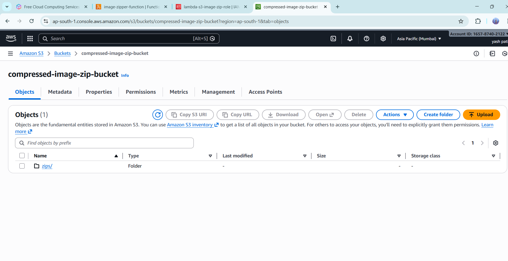

# Automated Image Zipping Pipeline using AWS Serverless Services

##  Overview

This project implements an **event-driven, fully serverless image processing pipeline** on AWS that automatically compresses uploaded images into ZIP files without requiring any server management.

##  Key Highlights

- Event-driven automation using S3 ObjectCreated events

- Serverless compute with AWS Lambda

- Secure access using IAM roles and policies

- Scalable and cost-efficient architecture

- No server provisioning or maintenance required

##  Architecture


---

##  Step-by-Step Configuration

## Step 1: Create S3 Buckets

- Create a source S3 bucket to store raw uploaded images.<br>
  Example: raw-image-uploads-bucket

- Create a destination S3 bucket to store compressed ZIP files.<br>
  Example: compressed-image-zip-bucket

## Step 2: Create IAM Role for Lambda

- Create an IAM role with AWS Lambda as the trusted service.

- Attach the following permissions:

- s3:GetObject and s3:ListBucket for the source bucket

- s3:PutObject for the destination bucket

- Attach AWSLambdaBasicExecutionRole for CloudWatch logging.
- create inline policy and role

```
{
	"Version": "2012-10-17",
	"Statement": [
		{
			"Effect": "Allow",
			"Action": [
				"s3:GetObject",
				"s3:ListBucket"
			],
			"Resource": [
				"arn:aws:s3:::raw-image-uploads-bucket",
				"arn:aws:s3:::raw-image-uploads-bucket/*"
			]
		},
		{
			"Effect": "Allow",
			"Action": "s3:PutObject",
			"Resource": "arn:aws:s3:::compressed-image-zip-bucket/*"
		}
	]
}


```

## Step 3: Create AWS Lambda Function

- Create a Lambda function using Python 3.10 runtime.

- Assign the previously created IAM role.

```
import json
import boto3
import zipfile
import os

s3 = boto3.client('s3')

DEST_BUCKET = 'compressed-image-zip-bucket'

def lambda_handler(event, context):
   # Get source info
   source_bucket = event['Records'][0]['s3']['bucket']['name']
   object_key = event['Records'][0]['s3']['object']['key']

   # File paths
   download_path = f"/tmp/{os.path.basename(object_key)}"
   zip_path = f"/tmp/{os.path.basename(object_key)}.zip"

   # Download image
   s3.download_file(source_bucket, object_key, download_path)

   # Create ZIP
   with zipfile.ZipFile(zip_path, 'w', zipfile.ZIP_DEFLATED) as zipf:
       zipf.write(download_path, arcname=os.path.basename(download_path))

   # Upload ZIP
   s3.upload_file(zip_path, DEST_BUCKET, f"zips/{os.path.basename(zip_path)}")

   return {
       "statusCode": 200,
       "body": "ZIP created successfully"
   }
```

- test and deploy

## Step 4: Configure S3 Event Trigger

- Configure an ObjectCreated event notification on the source S3 bucket.

- Set AWS Lambda as the destination.

- Optionally restrict triggers using file suffixes (e.g., .jpg, .png).

## Step 5: Upload and Process Images

Upload an image to the source S3 bucket.

S3 automatically triggers the Lambda function.

Lambda downloads the image, compresses it into a ZIP file, and uploads it to the destination bucket.

## Step 6: Verify Output

Confirm that the ZIP file appears in the destination S3 bucket.

Verify the file structure and compression.

Check CloudWatch logs for successful execution or errors.

---

##  Output

## 1. s3 Bucket


## 2. object inside the source bucket


## 3. create Iam role and policy


## 4. Lambda


## 5.destination output



## 6 cloudwatch log of lambda


--

##  Summary

The Automated Image Zipping Pipeline using AWS Serverless Services is a cloud-native, event-driven solution that automatically compresses uploaded images into ZIP files without requiring any server management. By leveraging Amazon S3 event notifications and AWS Lambda, the system processes files in real time, ensuring scalability, reliability, and cost efficiency.
